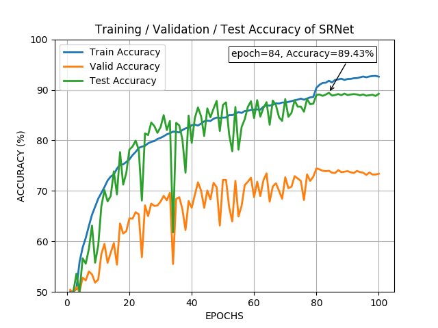

# Deep Residual Network for Steganalysis of Digital Images (SRNet model) Pytorch Implementation:

Model weights can be downloaded at https://drive.google.com/open?id=1wOhXdC9jWjYH60-qwTwegv1W-rWH5dVk
The model is trained on the S-Uniward 0.4bpp in the same setting as reported in the paper:
"Deep Residual Network for Steganalysis of Digital Images"
The model can be tested using the file test.py
The tensorflow code of the same can be found at: http://dde.binghamton.edu/download/feature_extractors/

The test accuracy reported in the paper is **89.77%**. My implementation achieved **89.43%** on S-Uniward 0.4bpp.

The model is trained and tested on Tesla V-100-DGX with 32GB GPU.

<table>
  <tr>
    <td align="center">SRNet architecture</td>
     <td align="center">Train/Validation/Test Accuracies</td>
  </tr>
  <tr>
    <td valign="top"></td>
    <td valign="top"></td>
  </tr>
 </table>
