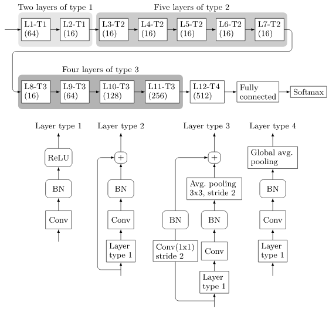

# Deep Residual Network for Steganalysis of Digital Images (SRNet model) Pytorch Implementation:

This is an unofficial implementation of paper: "Deep Residual Network for Steganalysis of Digital Images"
The model can be tested using the file test.py
The tensorflow code of the same can be found at: http://dde.binghamton.edu/download/feature_extractors/

The test accuracy reported in the paper is **89.77%**. My implementation achieved **89.43%** on S-Uniward 0.4bpp.

The model is trained and tested on Tesla V-100-DGX with 32GB GPU.

<table>
  <tr>
    <td align="center">SRNet architecture</td>
  </tr>
  <tr>
    <td valign="top"></td>
  </tr>
 </table>

 ### Datasets:
 You can find cover images here: [BOSSbase_1.01.zip](https://dde.binghamton.edu/download/ImageDB/BOSSbase_1.01.zip)
 
Steganography algorithms here: [SUniward](https://dde.binghamton.edu/download/stego_algorithms/download/S-UNIWARD_linux_make_v10.tar.gz), [WOW](https://dde.binghamton.edu/download/stego_algorithms/download/WOW_linux_make_v10.tar.gz), and [MiPOD](https://dde.binghamton.edu/download/stego_algorithms/download/MiPOD_matlab.zip).

Create corresponding stego images for each cover image with steganography algorithm of your choice. 
Make sure to change random seed for each image to get random key dataset.
